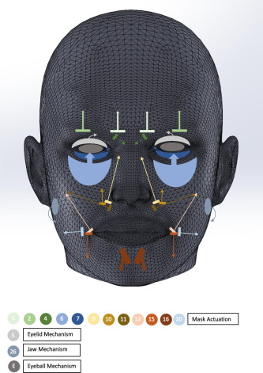

# Research regarding facial expressions

The goal is to make the humanoid robot respond by changing its facial expressions.

There are several different ways to do this.
The approach that seems to work is to have a silicon facial mold and use wires and motors to move them in a specific way to simulate moving muscles.

[Solidworks model](https://zenodo.org/record/3539723)

We can have these hooks at specific needed angles and use wires connected to servo motors to control it.

**Kinematics**

[paper](Automatic_Facial_Expression_Learning_Method_Based_on_Humanoid_Robot_XIN-REN.pdf)

Taking image capture of a human face and then using changes with expected result to tune the kinematics model.

[paper2](https://www.frontiersin.org/articles/10.3389/frobt.2021.730317/full)

[also uses same servo + wire mechanism](paper_string_based_2.pdf)